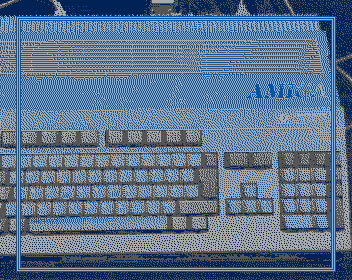
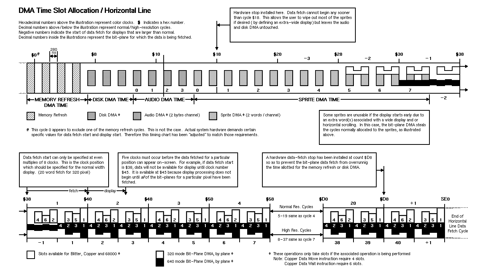
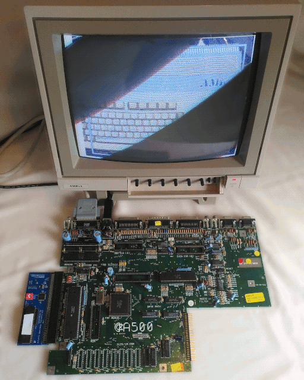

Amiga CPU Blit Read-Only (Proof of Concept ROM)
===============================================

Testing CPU drawing without _any_ memory writes.

Target:  
  - PAL OCS/ECS with 7(4+2)-bitplane anomaly
    (Agnus: 4-bitplane DMAs, Denise: 6-bitplane EHB,
    last two bitplane data is written with the CPU).
  - Motorola 68000/68010 CPU @ 7 MHz

The current research state fills a 352x280 screen with two bitplanes
(two colors and their half-bright variants) completely with the CPU.
While more vertical lines are possible, the 352 horizontal pixels are
the maximum (there are no cycles left for any HPOS synchronization).

Release files:  
  - [cpubltro-a1k.adf](cpubltro-a1k.adf) Kickstart disk (Amiga 1000)
  - [cpubltro-0fc.rom](cpubltro-0fc.rom) 256K ROM image (MapROM or emulator)
  - [cpubltro-0f8.rom](cpubltro-0f8.rom) 512K ROM image (MapROM or emulator)
  - [cpubltro-0f8.bin](cpubltro-0f8.bin) 512K byte swapped ROM image (EPROM)

If all works as expected, the screen looks like this:  

|   blit |                VPOS | VPOS + 1                                                                             |
|-------:|--------------------:|:-------------------------------------------------------------------------------------|
|  Agnus | `DDDDDDDDDDDDEEE00` | `0000000000000011111111111111112222222222222222333333333333333344444444444444445555` |
|   HPOS | `456789ABCDEF01201` | `23456789ABCDEF0123456789ABCDEF0123456789ABCDEF0123456789ABCDEF0123456789ABCDEF0123` |
| Denise | `DDDDDDDDDDDDDDDDE` | `EE00000000000000001111111111111111222222222222222233333333333333334444444444444444` |
|   HPOS | `0123456789ABCDEF0` | `120123456789ABCDEF0123456789ABCDEF0123456789ABCDEF0123456789ABCDEF0123456789ABCDEF` |
|    DMA | `1_4_2_3_1_4_2_3_1` | `__M_M_M_M_d_d_d_a_a_a_a_s_s_s_s_s_s_s_s_s_s_s_s_s_s_4_2_3_1_4_2_3_1_4_2_3_1_4_2_3_` |
|  MoveM | `________________.` | `p.-R.r.R.r.R.r.R.r.R.r.R.r.R.r.R.r.R.r.R.r.R.r.R.p________________________________` |
|  MoveR | `.W.w.p___________` | `__________________________________________________.W.w.p__________.W.w.p__________` |
|  MoveA | `______.R.r.W.w.p_` | `________________________________________________________.R.r.W.w.p______.R.r.W.w.p` |

| slot    | description                                                |
|:--------|:-----------------------------------------------------------|
| `M`     | DMA memory refresh channel (RGA used for video sync codes) |
| `d`     | DMA disk channel (custom.dskdatr/dskdat: disabled)         |
| `s`     | DMA sprite channels (custom.spr.dataa/datab: disabled)     |
| `1`-`6` | DMA bitplane channels (custom.bpldat: 1-4 Agnus, 5/6 CPU)  |
| `.`     | CPU intruction processing                                  |
| `p`     | CPU intruction word (pre)fetch                             |
| `R`/`r` | CPU memory read (big-endian most/least significant word)   |
| `W`/`w` | CPU memory write (big-endian most/least significant word)  |
| `-`     | CPU memory read/write wait cycle                           |
| MoveM   | `MOVEM.L (An)+,Rn*` (`.p.R(.r.R)*.p`, notice 1 extra `.R`) |
| MoveR   | `MOVE.L Rn,(An)` (`.W.w.p`)                                |
| MoveA   | `MOVE.L (An)+,(An)` (`.R.r.W.w.p`)                         |

The CPU synchronization of the first scanline is somewhat tricky,
since the Agnus HPOS (VHPOSR register) is off by +4 color clocks
from the Denise HPOS. However, the memory refresh DMA slots, that
are always used, help synchronizing the CPU fetches.

DMA Time Slot Allocation / Horizontal Line
(Amiga Hardware Reference Manual - edited/fixed):  

Notes
-----

Comments, bugfixes, and tests on real hardware are very welcome.

Emulation requires a very accurate CPU/DMA simulation, e.g.:  
  - [WinUAE](https://www.winuae.net/download/) 5.0.0+ (Windows/Wine)
  - [vAmiga.net](https://vamiganet.github.io/) (vAmiga online version)

For the previous research state (a simple loop counter), have a look at
[v0.1](https://github.com/nicodex/amiga-ocs-cpubltro/releases/tag/v0.1).

License
-------

This work is 'public domain' and licensed under the [CC0 1.0 Universal] license.

- [TLDRLegal: CC0 1.0 Universal](https://www.tldrlegal.com/license/creative-commons-cc0-1-0-universal)
- [gnu.org/licenses: CC0 1.0 Universal](https://www.gnu.org/licenses/license-list.html#CC0)

This project attempts to conform to the [REUSE] recommendations.

[CC0 1.0 Universal]: LICENSES/CC0-1.0.txt
[REUSE]: https://reuse.software/

