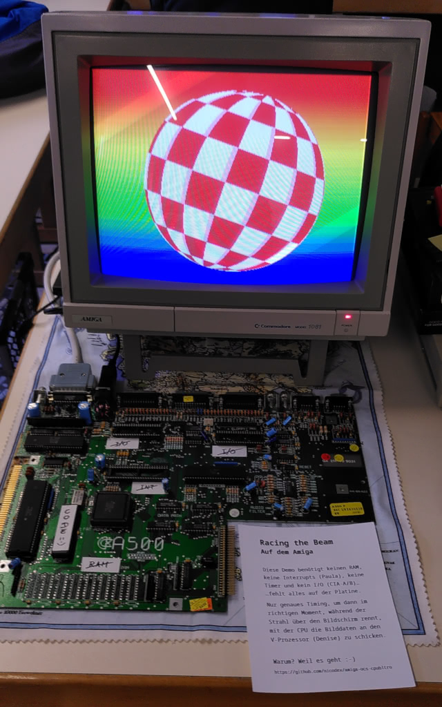
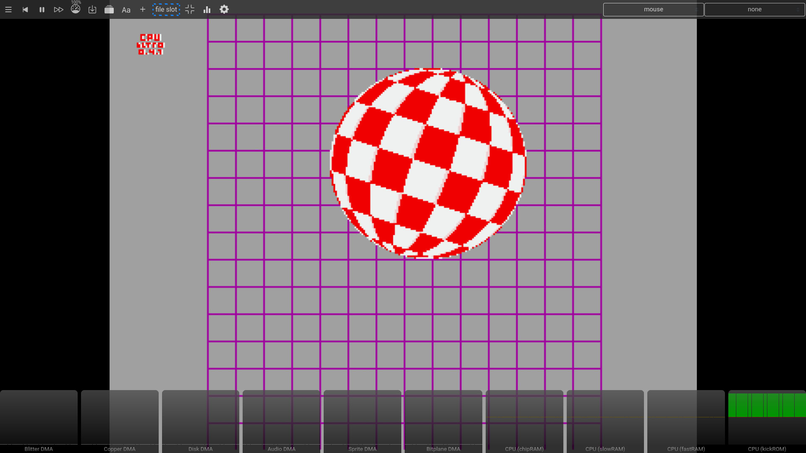

Amiga CPU Blit Read-Only (Proof of Concept ROM)
===============================================

Racing The Beam on the Amiga without RAM
----------------------------------------

Target requirements:  
  - Motorola 68000 CPU @ 7 MHz (fixed timing)

The current research state fills the bitplane and sprite data
completely with the CPU while the beam races over the screen.
Motorola 68010 support has been dropped to make things easier.

Release files:  
  - [cpubltro-ntsc.adf](cpubltro-ntsc.adf) NTSC Kickstart disk (Amiga 1000)
  - [cpubltro-ntsc.rom](cpubltro-ntsc.rom) NTSC 256K ROM image (MapROM/emu)
  - [cpubltro-pal.adf](cpubltro-pal.adf) PAL Kickstart disk (Amiga 1000)
  - [cpubltro-pal.rom](cpubltro-pal.rom) PAL 256K ROM image (MapROM/emu)

Revision 2025 demo (Amiga 500 without CIAs, Paula, and RAM):  


The Amiga 1000 Kickstart disks are the easiest way to test it on real hardware
(of course the Amiga 1000 needs RAM to load the Kickstart from the disk,
but the cpubltro ROM does neither read, nor write any RAM in the system).

Emulation requires a very accurate CPU/DMA simulation, e.g.:  
  - [WinUAE](https://www.winuae.net/download/) 5.0.0+ (Windows/Wine)
  - [vAmigaWeb](https://vamigaweb.github.io/) (Settings / Kickstart ROMs)



`TODO`: Replicate the original Boing! demo more closely (grid, sound).


Details
-------

DMA Time Slot Allocation / Horizontal Line
(Amiga Hardware Reference Manual - edited/fixed):  


With active ROM overlay and/or read-only RAM, we have:  
  - 17 stable CPU registers as work memory, for everything
  - no stack (exceptions/interrupts more or less unusable)
  - no bitplane/sprite/copper DMA, no blits (but BLTNZERO)

Normally the DMA controller (Agnus) fetches the bitplane data words
from Chip RAM and sends it to the video processor (Denise) by writing
to the BPLxDAT registers. The Denise converts that planar registers into
a color lookup and serializes it for the video DAC (Vidiot).
Since this conversion is triggered by BPL1DAT and BPLxDAT can be written
by the CPU, we are able to draw the complete scan line with the CPU.
Even sprites can be displayed (writing to SPRxDATA enables the sprite).

`TODO`: Much more detailed technical documentation.

Copy of my DMA time slot allocation development spreadsheet:  
```
DDDDDDEEE0000000000000000111111111111111122222222222222223333333333333333444444444444444455555555555555556666666666666666777777777777777788888888888888889999999999999999AAAAAAAAAAAAAAAABBBBBBBBBBBBBBBBCCCCCCCCCCCCCCCCDDDDDDDDDD|
ABCDEF0120123456789ABCDEF0123456789ABCDEF0123456789ABCDEF0123456789ABCDEF0123456789ABCDEF0123456789ABCDEF0123456789ABCDEF0123456789ABCDEF0123456789ABCDEF0123456789ABCDEF0123456789ABCDEF0123456789ABCDEF0123456789ABCDEF0123456789|
____|_b__M_M_M_M_d_d_d_a_a_a_a_s_s_s_s_s_s_s_s_s_s_s_s_s_s_s_s___b_______b_______b_______b_______b_______b_______b_______b_______b_______b_______b_______b_______b_______b_______b_______b_______b_______b_______b_______b_______b_|
____|+1__|______________________________________-3______-2______-1_______1_______2_______3_______4_______5_______6_______7_______8_______9______10______11______12______13______14______15______16______17______18______19______20_|
--->|____|_______________________________________________________________|<----------------------|-----------------------|---------------------------SPR0DAT-----------------------------------------------------|-------|---------|
____|____|_______________________________________________________________|<----------------------|-----------------------SPR1DAT----------------------------------------->---->__________________________________|_______|_________|
____|____|_______________________________________________________________|________<--------------|-------------------------------SPR2DAT----------------------------------------->---->__________________________|_______|_________|
____|____|_______________________________________________________________|________________<------|---------------------------------------SPR3DAT----------------------------------------->---->__________________|_______|_________|
____|____|_______________________________________________________________|_______________________|<----------------------------------------------SPR4DAT----------------------------------------->---->__________|_______|_________|
____|____|_______________________________________________________________|_______________________|________<----------------------------------------------SPR5DAT----------------------------------------->---->__|_______|_________|
____|____|_______________________________________________________________|_______________________|________________<----------------------------------------------SPR6DAT----------------------------------------->---->__|_________|
____|____|_______________________________________________________________|_______________________|_______________________|<----------------------------------------------SPR7DAT---------------------------------|------->---->____|
--->|____|_______________________________________________________________|<---------zero---------><----------------------|------------------------------------GRID-----------------------------------------------><-left-><-zero->-|
____.R.r.-W.w.p________________________________________________________MOVE.L_(a0)+,(A5)_________|_______________________|_______________________________________________________________________________________|_______|_________|
____|__________.R.r.p.W.w.p.R.r.p.W.w.p.R.r.p.W.w.p.R.r.p.W.w.p________MOVE.L_(a2)+,(d16,A5){4}__|_______________________|_______________________________________________________________________________________|_______|_________|
MOVE.W_D0,(A4)_________________________________________________.w.p______|_______________________|_______________________|_______________________________________________________________________________________|_______|_________|
MOVE.W_-(a1),Dn____________________________________________________..r.p_________________________|________________________\______________________________________________________________________________________|_______|_________|
MOVE.L_(a2)+,(d16,A5){2}________________________________________________.R.r.p.W.w.p.R.r.p.W.w.p_|_________________________\_____________________________________________________________________________________|_______|_________|
MOVE.W_d1,(A4)__________________________________________________________________________________.w.p____.w.p____.w.p____.w.p\___.w.p____.w.p####.w.p####.w.p####.w.p####.w.p####.w.p####.w.p####.w.p####.w.p##___|_______|_________|
MOVE.W_(a2)+,d3_____________________________________________________________________________________.r.p____________.r.p_____\___________________________________________________________________________________|_______|_________|
MOVE.W_d3,(a3)[+]___________________________________________________________________________________________.w.p____________.w.p_________________________________________________________________________________|_______|_________|
SUBQ.L_#2,a3________________________________________________________________________________________________________________________.p.._________________________________________________________________________|_______|_________|
MOVE.W_#$8000,(A4)____________________________________________________________________________________________________________________________________________________________________________________________.p.w.p#########______|
SUBA.W_(a7)+,a2______________________________________________________________________________________________________________________________________________________________________________________________________________.r.p..|
..p.p__________________________________________________________________DBF_d7______________________________________________________________________________________________________________________________________________________|
___________________________________________________________________________________________________________________________________________________________________________________________________________________________________|
___________________________________________________________________________________________________________________________________________________________________________________________________________________________________|
```


Notes
-----

Comments, bugfixes, and tests on real hardware are very welcome.

Previous research states:  
  - [v0.3.2](https://github.com/nicodex/amiga-ocs-cpubltro/tree/v0.3.2)
    LoRes fullscreen animation with gradient
  - [v0.2.1](https://github.com/nicodex/amiga-ocs-cpubltro/tree/v0.2.1)
    `EHB42 mode`, static 352x280 image
  - [v0.1](https://github.com/nicodex/amiga-ocs-cpubltro/tree/v0.1)
    `EHB42 mode`, simple loop counter

`EHB42 mode` is my name for an Amiga OCS/ECS chipset anomaly:  
With `BPLCON0.BPU = 7` the Agnus fills 4 bitplanes with DMA,
but the Denise draws 6 bitplanes (in Extra Half Brite mode).
`BPL5DAT/BPL6DAT` are not written by the Agnus and can/have
to be filled by CPU. This can/will be used for nice effects.


License
-------

This work is 'public domain' and licensed under the [CC0 1.0 Universal](LICENSES/CC0-1.0.txt) license.

- [TLDRLegal: CC0 1.0 Universal](https://www.tldrlegal.com/license/creative-commons-cc0-1-0-universal)
- [gnu.org/licenses: CC0 1.0 Universal](https://www.gnu.org/licenses/license-list.html#CC0)

This project attempts to conform to the [REUSE](https://reuse.software/) recommendations.


