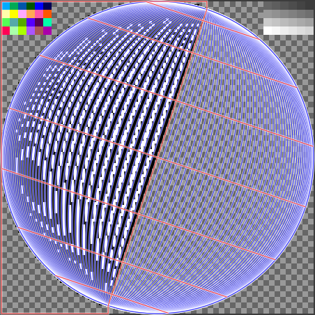

# images/

## ball images

### PAL 5:4 (50 Hz, 24 images, PAR 1:1)

- [balleast/](balleast/) PAL eastward rotation (move left) images
- [ballwest/](ballwest/) PAL westward rotation (move right) images

### NTSC 4:3 (60 Hz, 28 images, PAR 5:6)

- [ntsceast/](ntsceast/) NTSC eastward rotation (move left) images
- [ntscwest/](ntscwest/) NTSC westward rotation (move right) images

## ball workflow

The [ballanim.py](ballanim.py) script is used to create the
`(ball|ntsc)(east|west)/image*.png` from `(ball|ntsc)cmap.png`
(greyscale images where intensity levels are animation steps,
 see [gimp/ballpath.gpl](gimp/ballpath.gpl) for the mapping):  

The `(ball|ntsc)cmap.png` color maps have been created in GIMP
(the palette colors can be inverted to create the second half):  
- [gimp/ballpath.xcf](gimp/ballpath.xcf) PAL color map (GIMP 3.0+)  
  
- [gimp/ntscpath.xcf](gimp/ntscpath.xcf) NTSC color map (GIMP 3.0+)  
  

Since the animations steps are really small (2px and less), the
[gimp/ballpath.py](gimp/ballpath.py) creates SVGs with paths,
that have been imported into GIMP to start working on the cmap:  
- [gimp/ballpath.svg](gimp/ballpath.svg) PAL cmap base (only paths)  
  
- [gimp/ntscpath.svg](gimp/ntscpath.svg) NTSC cmap base (only paths)  
  

## ball drawing

To keep the drawing routine short and simple, an offset table
for every displayed display line is introduced, that moves the
sprite data pointer backwards after processing every line.
Therefore the sprites are completely drawn from top to bottom.

`TODO`: This could be further optimized to skip inside sprite lines:  

## cursor image

Mouse pointer might be removed later to free DMA slots for other features.

