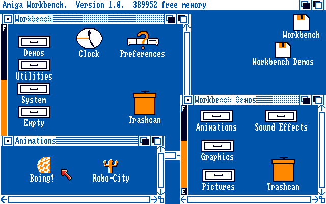
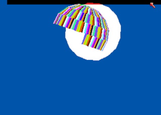
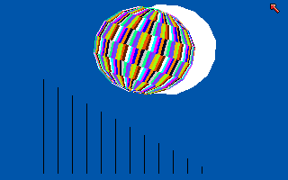
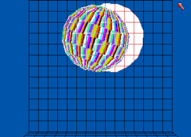
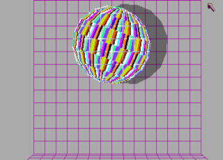
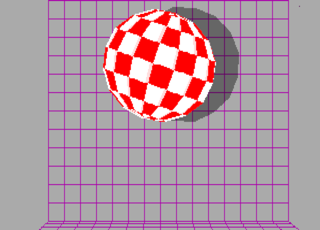
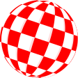

Links
=====

- [Yet Another Cycle Hunting Table (Yacht)](https://www.atari-forum.com/viewtopic.php?f=68&t=24710)

Boing
=====

Original Boing! animation on "Workbench Demos" disk (1985-08-22):  
  

  

  

Converted to SVG (round and with 1:1 pixel aspect ratio):  
  - [images/amiga-boing-ball.svg](images/amiga-boing-ball.svg)
    single red/white initial animation frame without shadow
  - [images/amiga-boing-ball_anim.svg](images/amiga-boing-ball_anim.svg)
    full red/white color cycling animation without shadow
    (a fast SVG renderer is required for a smooth display)
  - [images/amiga-boing-ball_cmap.svg](images/amiga-boing-ball_cmap.svg)
    grayscale ball segment overview image (with shadow)

  

