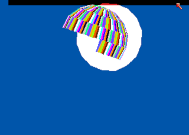
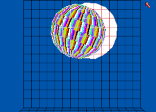

Links
=====

- [Yet Another Cycle Hunting Table (Yacht)](https://www.atari-forum.com/viewtopic.php?f=68&t=24710)

Boing
=====

Oldest `Boing!` animation found on `Workbench Demos` disk from 1985-08-22.

Grabs
-----

Scaled with effective original ball PAR 20:23 (DAR 32:23).

  

  

  

Ghidra
------

More or less complete analysis of the above `Boing!` executable.

- install [Ghidra 11.3.1](https://github.com/NationalSecurityAgency/ghidra/releases/tag/Ghidra_11.3.1_build)
  and the [Motorola FFP extension](https://github.com/nicodex/ghidra_motorolaffp/releases)
- restart Ghidra and restore [ghidra/wb_1.0_demos-22aug85-boing.gar](ghidra/wb_1.0_demos-22aug85-boing.gar)  
  
- double-click `wb_1.0_demos-22aug85/Animations/Boing!` and take a look around  
  

